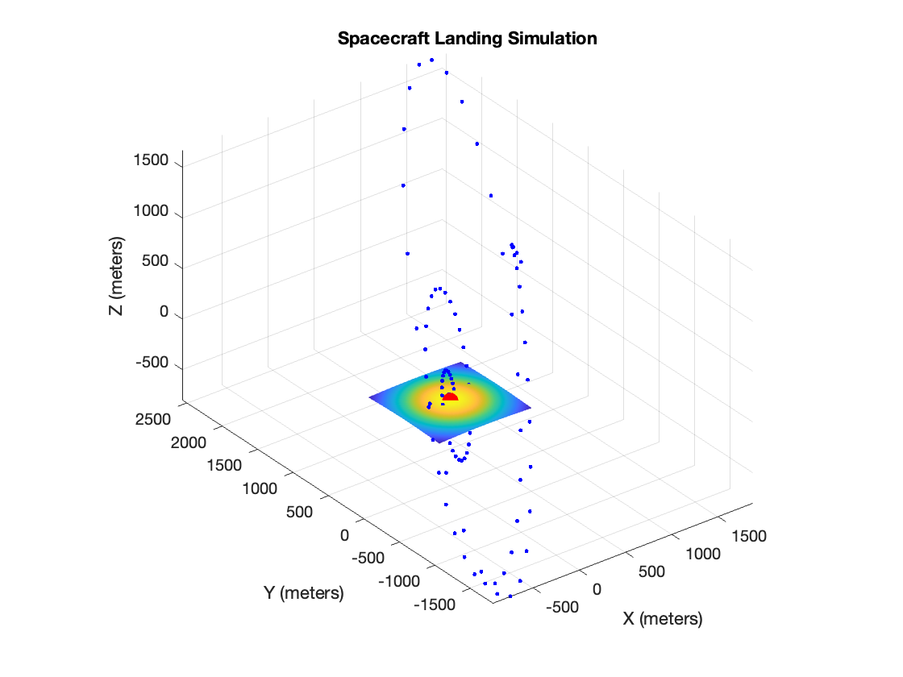

# Lunar Landing Simulation with Kalman Filter

This MATLAB project simulates the landing of a spacecraft on the lunar surface using a Kalman Filter. The simulation includes a dynamic lunar surface with statistical methods for optimal landing zone identification and 3D trajectory visualization.

## Simulation Figure

The simulation figure visualizes the trajectory of the spacecraft during the landing. The dynamic lunar surface and optimal landing zone are represented, showcasing the application of the Kalman Filter for accurate landing.

## Getting Started

To run the simulation, open the `SpacecraftLandingSimulation.m` script in MATLAB and execute it. Make sure to customize parameters and tweak the simulation as needed.

## Contributing

Feel free to contribute to the project by opening issues or submitting pull requests.

## License

This project is licensed under the MIT License - see the [LICENSE](LICENSE) file for details.
